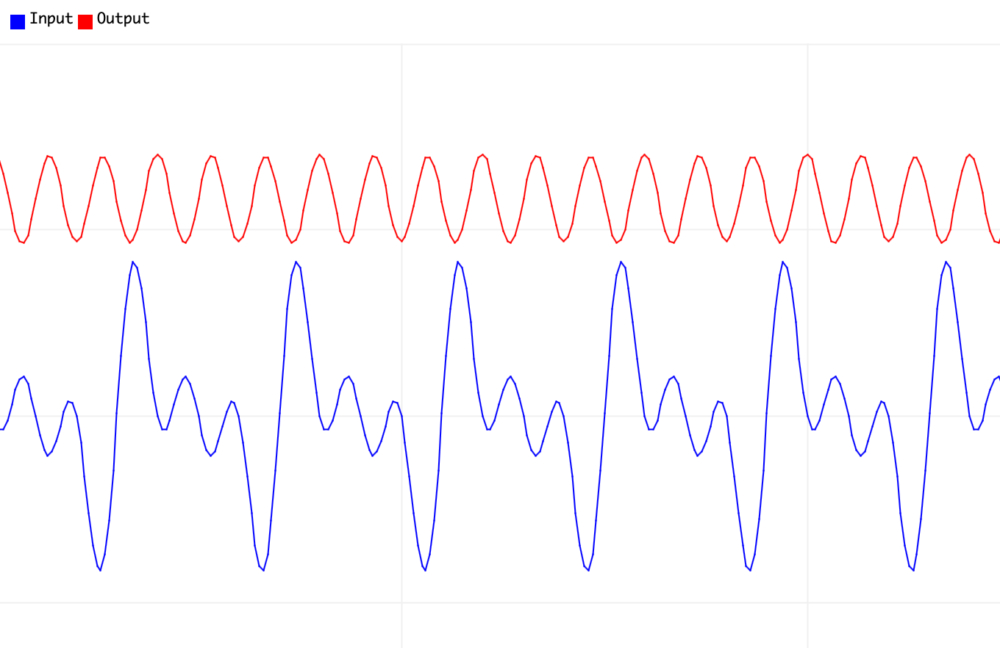

# Digital Filter Designer

A lightweight C++ library for **digital filter synthesis** on **embedded environments**, with support for runtime design adjustments.  
This library aims to provide a flexible and efficient way to implement classical IIR filters such as **Butterworth** and **RBJ CookBook** directly on microcontrollers and other resource-constrained devices.

### ✨ Features

- Runtime-adjustable cutoff frequencies and sampling rates
- Biquad section generation for efficient runtime filtering
- Header-only, portable, and STL-compatible (optional)
- **Stack-based memory allocation** for improved performance and readability on systems with limited volatile memory

## 🚀 Usage Example
Just include the header files in your project and call for the tools inside **FilterDesigner** namespace.

Below is a example of how to use the library in a C++ project:

```cpp
//Include the Butterworth designer
#include "butterworth_design.hpp"

//Only bandpass filter
using FilterDesigner::ButterworthBandpass;

//Filter parameters
const float g_samples = 200.0;  //Sample rate frequency [Hz]
const float g_lowcut  = 15.0;   //Low cut frequency     [Hz]
const float g_highcut = 25.0;   //High cut frequency    [Hz]
const short g_order   = 4;      //Filter order

//Create a Butterworth band-pass design.
ButterworthBandpass<float, g_order> filter(g_samples, g_lowcut, g_highcut);

//Checks if filter synthesis fail
if (!filter.designSuccess()) while (true) { }

//= LOOP ================================================================== 
//Sinusoidal signals
float s1 = sin(1.0 * PI * 10.0 * interval_micros);  //10 Hz
float s2 = sin(1.0 * PI * 20.0 * interval_micros);  //20 Hz
float s3 = sin(1.0 * PI * 30.0 * interval_micros);  //30 Hz

//Merge signals
float input = s1 + s2 + s3;

//​Generates the output signal using a raw signal through biquad cascade.
float output = input;
for (size_t index = 0; index < filter.m_num_sos; index++)
      output = filter.m_sos_sections[index].process(output);
```



### 🔧 Planned Improvements

- Fix odd order filter generation
- Add support for arbitrary band-stop filters
- Add Chebyshev Type I and Elliptic filter designs
- Add CMSIS support for ARM architecture
- Include fixed-point arithmetic mode for deeply embedded systems